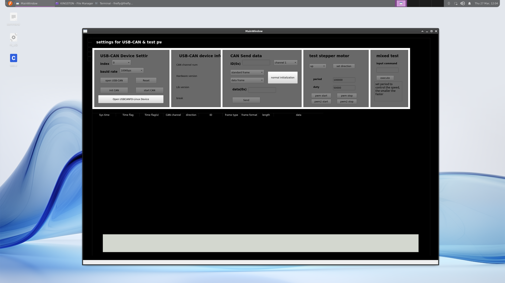
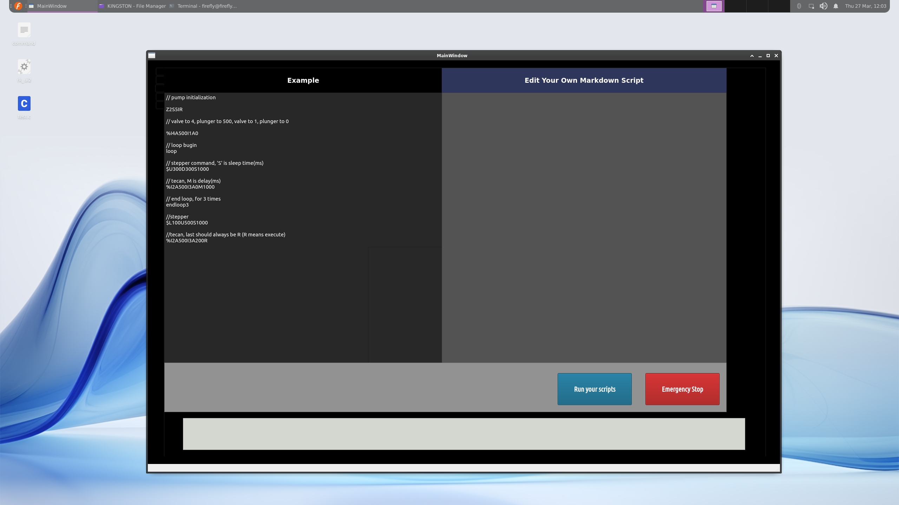

## intro

The repo for the QT program, the software part of my graduate design

### hardware

| name      | version |
| ----------- | ----------- |
| RK3566      | firefly RK3566 ROC PC   |
| USB-CAN Communicator   |         |
|Stepper Motor Driver| microstep driver HB-415M |
|Stepper Motor||
|Pump| Tecan xx |

### software

function achieved and in development

- [x] CAN connection and CAN original message send
- [x] drive and control TeCan pump
- [x] set RK3566 linux device tree, open pwm pins and control pwm in QT program
- [x] mixed command to control both tecan and stepper motor
- [ ] add modules and buttons for convenient and easy use
- [ ] write docs for setting the system

a half-finished docs can be found here

https://iw3ft6u1hzy.feishu.cn/wiki/QpXCwSFcdi9gwBkE8vOcHkAtnKc?from=from_copylink

## use

2 main interface in RK3566

